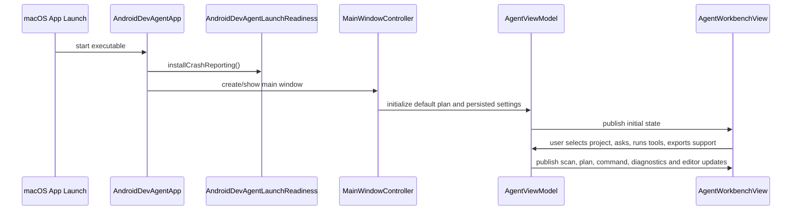
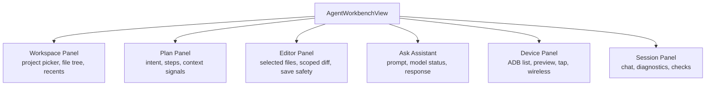

# 01 Runtime Shell and UI Workbench

## Purpose

The runtime shell turns the core Android development agent into a native macOS workbench. It owns app startup, the main window, settings, menu actions, update checks, and the SwiftUI surfaces where a developer scans a project, asks for help, runs tools, edits files, and exports diagnostics.

## Primary Components

| Component | File | Responsibility |
| --- | --- | --- |
| App entry and menus | `Sources/AndroidDevAgent/AndroidDevAgentApp.swift` | Installs crash reporting, creates menu actions, opens settings/log folders, wires Sparkle update checks. |
| Workbench view | `Sources/AndroidDevAgent/AgentWorkbenchView.swift` | Main SwiftUI layout for project workspace, editor, assistant, device preview, command output, and diagnostics tabs. |
| Workbench state | `Sources/AndroidDevAgent/AgentViewModel.swift` | Main `@MainActor` state owner for scanning, planning, command execution, editor state, assistant state, diagnostics, and support exports. |
| Settings popover | `Sources/AndroidDevAgent/AgentSettingsPopover.swift` | Provider settings, launch-readiness controls, and account/setup summaries. |
| Style primitives | `Sources/AndroidDevAgent/AgentWorkbenchStylePrimitives.swift` | Shared cards, buttons, rows, palette, layout and accessibility helpers. |
| Launch readiness controls | `Sources/AndroidDevAgent/LaunchReadinessControls.swift` | Settings and diagnostics UI for telemetry, upload consent, licensing, support bundle export, and support upload. |

## Runtime Flow

## State Ownership

`AgentViewModel` is intentionally broad because the workbench is an integrated tool surface. It owns:

- Project state: selected path, scan state, `WorkspaceSnapshot`, `ProjectProfile`, modules, variants, package override, and launch activity.
- Plan state: prompt, inferred `AgentPlan`, selected plan step, plan refresh state.
- Command state: output stream, running command kind, last command summary, stdout/stderr buckets, truncation state, and pending confirmations.
- Device state: selected ADB serial, device list, wireless debugging discovery, QR payload, screenshots, tap state, and auto-refresh.
- Editor state: open documents, dirty state, save diff, undo checkpoint, secret scan summary, selected document.
- Assistant state: response, action summary, export path, TaskDroid/OpenAI setup, provider-sharing consent, and credential status.
- Diagnostics/support state: debug report path, support bundle path, upload status, launch-readiness rows, safety rows, verification rows.

## UI Composition

## Boundary Decisions

- The executable target includes only `AndroidDevAgentApp.swift`; all reusable UI logic lives in `AndroidDevAgentUI`.
- Workbench UI never constructs raw Gradle or ADB commands directly. It asks the view model, which uses `AndroidToolCommandFactory`.
- App-level menu actions call readiness helpers for support/log folders, keeping file locations centralized in `LaunchReadinessSupport.swift`.
- Sparkle setup remains in the executable target because it is app bundle specific and depends on Info.plist release metadata.

## Failure and Recovery

- A missing or cancelled project selection leaves the app in a safe waiting state.
- Failed scans preserve prior state when possible and show a diagnostic row.
- Running commands can be stopped through the process runner and view model state is cleared after completion or timeout.
- Missing support/debug export files show availability messages rather than failing silently.
- Launch readiness directories use Application Support/Logs with a temporary directory fallback.

