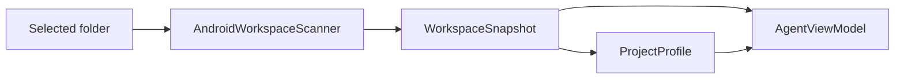
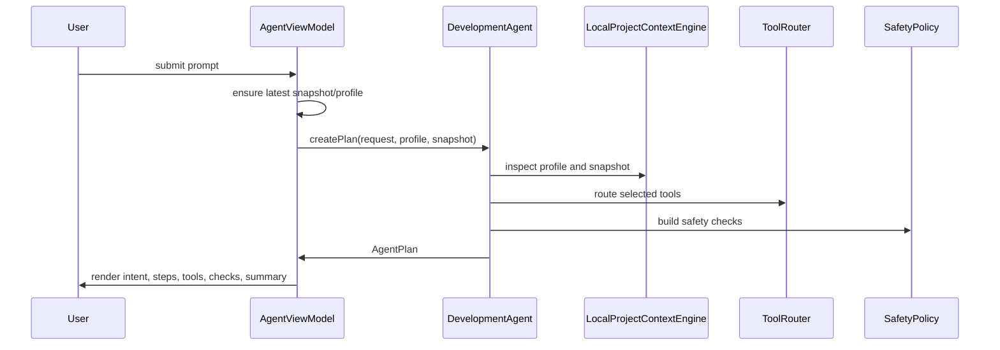

# 02 Project Context and Planning

## Purpose

Project context and planning convert a user request into an Android-aware plan. This layer identifies the workspace shape, infers intent, selects tools, applies safety checks, and produces a structured plan the workbench can render and act on.

## Primary Components

| Component | File | Responsibility |
| --- | --- | --- |
| Workspace scanner | `Sources/AndroidDevAgentCore/AndroidWorkspaceScanner.swift` | Reads Android project structure and extracts Gradle, Manifest, language, UI, SDK, and test signals. |
| Local context engine | `Sources/AndroidDevAgentCore/LocalProjectContextEngine.swift` | Turns project/profile/snapshot/request into ranked context signals. |
| Planner | `Sources/AndroidDevAgentCore/DevelopmentAgent.swift` | Normalizes prompt, infers intent, builds plan steps, routes tools, and calculates confidence. |
| Tool router | `Sources/AndroidDevAgentCore/ToolRouter.swift` | Selects relevant capabilities for crash, Gradle, UI, testing, device, and release requests. |
| Catalog | `Sources/AndroidDevAgentCore/AgentCatalog.swift` | Defines architecture, features, and tool capabilities exposed to the UI and tests. |
| Safety policy | `Sources/AndroidDevAgentCore/SafetyPolicy.swift` | Produces safety checks based on selected tools and prompt risk. |
| View model bridge | `Sources/AndroidDevAgent/AgentViewModel.swift` | Owns scanning lifecycle, recents, profile updates, and plan refresh. |

## Scan Data Model

`WorkspaceSnapshot` captures:

- File and test counts.
- Gradle wrapper and settings file availability.
- AndroidManifest availability.
- Compose, Kotlin, Java, and XML layout signals.
- Package name, min SDK, and target SDK when discoverable.

The scanner avoids heavy/generated folders such as `.gradle`, `.idea`, `build`, `.build`, `DerivedData`, and `dist`.

## Planning Flow

## Intent Categories

| Intent | Trigger examples | Extra plan/tool behavior |
| --- | --- | --- |
| Crash and Logcat triage | crash, exception, stack trace, logcat, ANR | Adds Logcat analyzer and emulator driver; adds log redaction safety. |
| Build and dependency repair | Gradle, dependency, manifest, compile, sync | Adds dependency and manifest editors; flags release/config risk. |
| Android UI implementation | screen, UI, Compose, XML, layout, theme | Adds screen generator and screenshot inspector. |
| Test automation | test, coverage, JUnit, Espresso, instrumentation | Adds unit and instrumentation test runners. |
| Release readiness | release, signing, ProGuard, R8, Play Store | Keeps release implications in safety checks. |
| Feature implementation | default | Uses base scan, patch, build/test, and summary path. |

## Plan Shape

Every plan starts with:

1. Clarify task contract.
2. Scan Android workspace.

Conditional steps then add reproduction, UI design, or configuration repair. Every plan finishes with:

1. Propose scoped patch.
2. Run verification.
3. Report result.

This gives the UI a stable plan skeleton while still adapting to intent.

## Extension Points

- Add a new intent in `DevelopmentAgent.inferIntent`.
- Add step behavior in `DevelopmentAgent.buildSteps`.
- Add a new tool in `AgentCatalog.tools`.
- Route the tool in `ToolRouter.route`.
- Add risk language in `SafetyPolicy.checks`.
- Add UI action behavior in `AgentViewModelAssistantResponses.swift` if the assistant should take a concrete local action.

