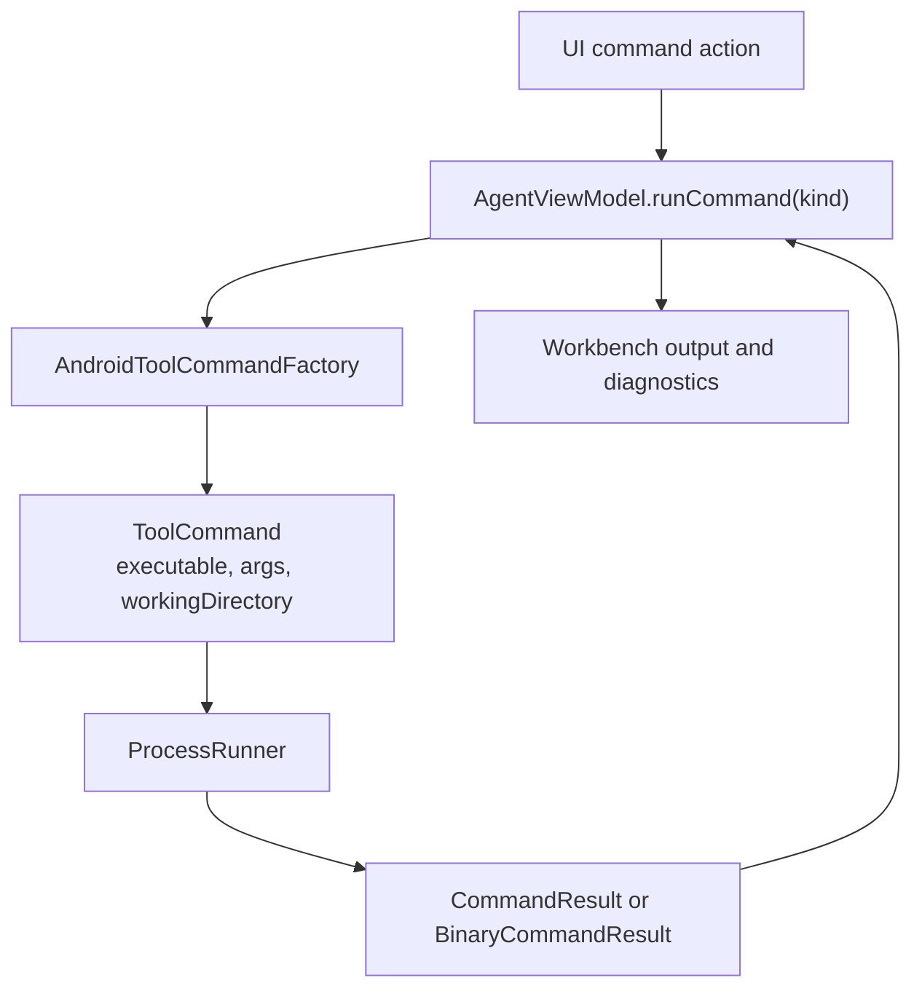
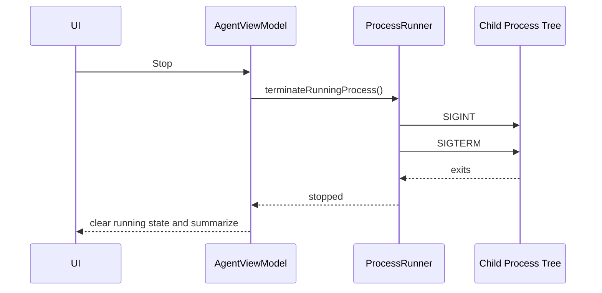

# 03 Command Execution and Device Automation

## Purpose

Command execution lets the desktop app safely run Gradle, ADB, Logcat, device screen capture, wireless debugging, and instrumentation workflows against the selected Android project.

## Primary Components

| Component | File | Responsibility |
| --- | --- | --- |
| Command factory | `Sources/AndroidDevAgentCore/AndroidToolCommandFactory.swift` | Builds `ToolCommand` values for Gradle and ADB operations. |
| Process runner | `Sources/AndroidDevAgentCore/ProcessRunner.swift` | Runs commands asynchronously, captures stdout/stderr/binary data, supports timeout and termination. |
| Command state | `Sources/AndroidDevAgent/AgentViewModel.swift` | Gates commands by scan/device state, handles confirmations, output, summaries, and cleanup. |
| Device state types | `Sources/AndroidDevAgent/AgentViewModelTypes.swift` | Models command kinds, device rows, wireless devices, confirmations, and diagnostics. |
| Device UI | `Sources/AndroidDevAgent/AgentWorkbenchView.swift` | Exposes run buttons, device preview, tap controls, wireless debugging, and diagnostics rows. |

## Command Construction

## Gradle Execution Design

The command factory resolves Gradle in this order:

1. Executable `gradlew` in the selected root.
2. Non-executable `gradlew` through `/bin/sh ./gradlew`.
3. System `gradle` through `/usr/bin/env`.

All Gradle commands use `--no-daemon` and `--console=plain` so output is deterministic and easier to summarize.

Common tasks:

- Unit tests: `testDebugUnitTest`
- Assemble: `assembleDebug`
- Instrumentation: `connectedDebugAndroidTest`

## ADB and Device Operations

ADB path resolution checks:

1. `ANDROID_HOME/platform-tools/adb`
2. `ANDROID_SDK_ROOT/platform-tools/adb`
3. `~/Library/Android/sdk/platform-tools/adb`
4. `/usr/bin/env adb`

Supported operations include:

- `adb devices -l`
- `adb mdns services`
- `adb pair`, `adb connect`, `adb disconnect`
- `adb logcat -d -t`
- `adb shell am start`
- `adb logcat -c`
- `adb exec-out screencap -p`
- `adb shell input tap`
- `adb shell pm list instrumentation`
- `adb shell am force-stop`

Launch is a two-step workflow. It runs the selected module's Gradle `install<Variant>` task with `ANDROID_SERIAL` set to the selected ADB device, then runs `adb shell am start` only after installation succeeds. The install task is always run, so it handles both first installation and replacement of an existing app without relying on an installed-package preflight check.

## Risk Gates

`AndroidCommandKind` defines device requirements, confirmation requirements, timeout seconds, and risk summaries.

| Command kind | Device required | Confirmation | Default timeout |
| --- | --- | --- | --- |
| Unit Tests | No | No | 90s |
| Assemble | No | No | 120s |
| Device Tests | Yes | Yes | 180s |
| Devices | No | No | 20s |
| Logcat | Yes | No | 20s |
| Clear Logs | Yes | Yes | 20s |
| Launch | Yes | Yes | 180s install, then 25s launch |

## Cancellation and Timeouts

`ProcessRunner` tracks the current process and a termination generation. Stop requests send `SIGINT`, wait briefly, then send `SIGTERM` to the process tree discovered through `ps -axo pid=,ppid=`.

## Binary Capture Path

Screenshots use `runBinary` so PNG bytes do not pass through lossy UTF-8 conversion. `LockedDataBuffer` accumulates stdout/stderr from readability handlers while the process is running, then `AgentViewModel` converts screenshot data into `NSImage` for the preview panel.

## Failure Modes

- Missing executable: runner returns exit code `-1` with localized error.
- Timeout: runner returns exit code `-2` with captured output and timeout stderr.
- Missing device: view model blocks device-required commands before execution.
- Risky device action: view model creates a confirmation object before running.
- Long output: view model truncates UI output but keeps summaries and export paths.
