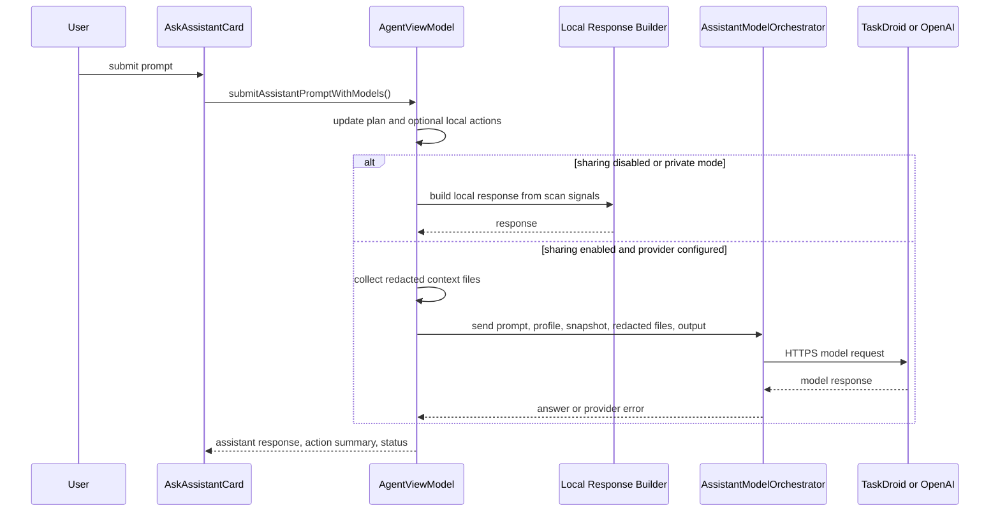

# 04 Assistant Model and Privacy Architecture

## Purpose

Ask Assistant provides project-aware responses while keeping provider sharing explicit. The private local path uses scanned project metadata and deterministic response templates. Optional provider paths can use TaskDroid or OpenAI only when the user enables sharing and model setup is valid.

## Primary Components

| Component | File | Responsibility |
| --- | --- | --- |
| Assistant UI | `Sources/AndroidDevAgent/AskAssistantCard.swift` | Prompt entry, response display, action buttons, and status. |
| Assistant actions/responses | `Sources/AndroidDevAgent/AgentViewModelAssistantResponses.swift` | Local action triggers, response generation, representative file selection, context redaction. |
| Model setup state | `Sources/AndroidDevAgent/AgentViewModelModelSetup.swift` | TaskDroid/OpenAI configuration, privacy disclosure, validation, and consent summaries. |
| Credential store | `Sources/AndroidDevAgent/AssistantModelCredentialStore.swift` | OpenAI API key storage and retrieval through Keychain. |
| Orchestrator | `Sources/AndroidDevAgentCore/AssistantModelOrchestrator.swift` | External provider request construction, response parsing, fallback handling, and model metadata. |
| Launch readiness audit | `Sources/AndroidDevAgent/LaunchReadinessSupport.swift` | Records provider-sharing and support consent events in privacy audit logs. |

## Privacy Modes

| Mode | Provider sharing consent | File excerpts | Command output | Provider route |
| --- | --- | --- | --- | --- |
| Private local | Off or explicit private mode | Blocked | Blocked | Local deterministic route |
| Automatic with sharing | On | Redacted excerpts allowed | Recent output allowed | TaskDroid if configured, otherwise OpenAI if key exists |
| TaskDroid preferred | On and TaskDroid configured | Redacted excerpts allowed | Recent output allowed | Customer TaskDroid endpoint |
| OpenAI available | On and OpenAI key exists | Redacted excerpts allowed | Recent output allowed | OpenAI |

## Request Flow

## Context Selection

Assistant context is intentionally small and task-biased:

- Always considers README, Gradle settings, version catalog, module Gradle files, and manifests.
- Includes open editor documents.
- Adds representative files matching prompt terms and project signals.
- Caps loaded context file count and content length.
- Skips directories, unavailable files, unsupported paths, and files larger than the configured local threshold.

## Redaction Path

Before any file excerpt is shared with a model provider, `redactAssistantContext` masks lines containing sensitive terms such as API keys, tokens, secrets, passwords, signing data, keystore values, store passwords, and key passwords.

The support infrastructure has a stronger support-bundle redaction pass. Assistant redaction is optimized for provider prompt context; support redaction is optimized for logs and uploaded diagnostics.

## Local Action Hooks

The assistant can start safe local workflows from prompt intent:

- Scan project when no project is loaded.
- Refresh devices.
- Run unit tests.
- Run assemble.
- Capture Logcat when a device is selected.
- Open likely edit targets when the prompt asks for a code change.

Riskier actions still flow through the normal view model gates and confirmations.

## Provider Setup

TaskDroid configuration can come from Settings or environment:

- `TASKDROID_API_BASE_URL` or `TASKDROID_URL`
- `TASKDROID_API_TIMEOUT_SECONDS` or `TASKDROID_TIMEOUT_SECONDS`

OpenAI credentials come from Keychain or `OPENAI_API_KEY`.

The UI reports the active provider account state without exposing the secret value.

## Failure Modes

- Sharing disabled: model providers are not called; local answer is used.
- Invalid TaskDroid URL or timeout: setup summary explains the configuration issue.
- Provider error: surfaced in assistant model status without silently falling back in cases covered by smoke tests.
- Missing project context: assistant asks the user to scan or choose a project.

