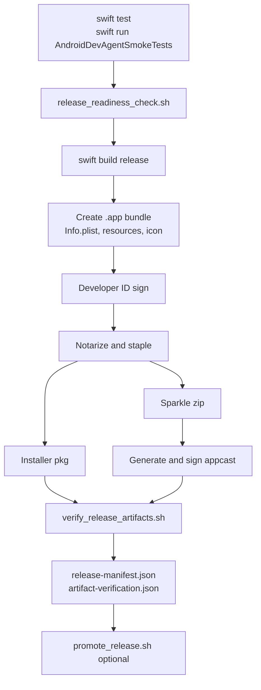

# 05 Release Packaging and Update Pipeline

## Purpose

The release pipeline converts the Swift package into a signed, notarized, Sparkle-updatable macOS app with launch-readiness endpoints, release notes, artifact verification, appcast promotion, and rollback support.

## Primary Components

| Component | File | Responsibility |
| --- | --- | --- |
| Package script | `scripts/package_macos_app.sh` | Builds app bundle, writes Info.plist, signs, notarizes, zips, creates pkg, embeds release notes, generates appcast, writes manifest. |
| Release gate | `scripts/release_readiness_check.sh` | Blocks market release unless signing, update, license, privacy, support, crash, symbol, rollout, and Android evidence are configured. |
| Artifact verifier | `scripts/verify_release_artifacts.sh` | Verifies bundle metadata, signatures, notarization staples, package signature, zip contents, and appcast signatures. |
| Release notes generator | `scripts/generate_release_notes.sh` | Produces release notes for embedding and manifest references. |
| Promotion | `scripts/promote_release.sh` | Stages appcast hosting files, snapshots previous channel, and promotes new artifacts. |
| Rollback | `scripts/rollback_release.sh` | Restores previous hosted channel snapshot. |
| CI workflow | `.github/workflows/production-release.yml` | Runs tests, packages, notarizes, verifies, uploads artifacts, and optionally promotes. |

## Release Candidate Flow



## Required Release Configuration

The launch gate requires:

- Bundle and signing: `BUNDLE_ID`, `SIGNING_IDENTITY`, `INSTALLER_SIGNING_IDENTITY`, notarization credentials or `NOTARYTOOL_PROFILE`.
- Updates: `SPARKLE_PUBLIC_ED_KEY`, `APPCAST_URL`, rollout and rollback plan paths.
- Licensing: `LICENSE_ACTIVATION_URL`, `LICENSE_REFRESH_URL`, `LICENSE_RECOVERY_URL`, `LICENSE_TRANSFER_URL`, `LICENSE_POLICY_PATH`.
- Privacy/support: `PRIVACY_POLICY_URL`, `DATA_RETENTION_POLICY_PATH`, `SUPPORT_REDACTION_POLICY_PATH`.
- Support/crash: `CRASH_REPORTING_ENDPOINT`, `SUPPORT_UPLOAD_ENDPOINT`, `SYMBOL_UPLOAD_ENDPOINT`, `CRASH_PIPELINE_RUNBOOK_PATH`.
- Android evidence: `ANDROID_MATRIX_REPORT_PATH`.

All backend URLs in the release gate must be HTTPS.

## Info.plist Release Stamps

The package script writes runtime configuration into the app bundle:

- Sparkle feed and public key.
- Release notes resource.
- License activation, refresh, recovery, and transfer endpoints.
- Privacy policy URL.
- Crash reporting endpoint.
- Support upload endpoint.
- Symbol upload endpoint.
- Optional dSYM UUID.

`AndroidDevAgentLaunchReadiness` reads these keys at runtime, with environment overrides for local validation.

## Output Artifacts

```text
dist/release/<channel>/<version>-<build>/AndroidDevAgent-<version>-<build>-<channel>.zip
dist/release/<channel>/<version>-<build>/AndroidDevAgent-<version>-<build>-<channel>.pkg
dist/release/<channel>/<version>-<build>/RELEASE_NOTES.md
dist/release/<channel>/<version>-<build>/release-manifest.json
dist/release/<channel>/<version>-<build>/artifact-verification.json
dist/updates/<channel>/appcast.xml
```

## Rollback Design

Promotion snapshots the prior hosted channel before replacing it. Rollback restores that snapshot and writes a rollback manifest. The release gate requires an explicit appcast hosting directory or rsync target when promotion is enabled so local defaults cannot accidentally become production.

## App Store Launch Implications

Even if distribution is outside the Mac App Store, launch readiness expects App Store-grade support behavior:

- User-facing support bundle export and consent-gated upload.
- Redaction before export and upload.
- Crash records tied to app version/build and dSYM metadata.
- Release evidence for privacy, retention, support handling, rollout, and rollback.

