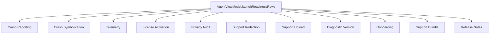
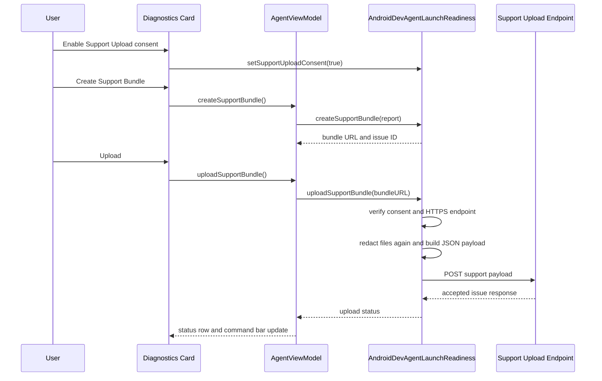

# 06 Launch Readiness Support Infrastructure

## Purpose

Launch readiness is the operational support layer for the app. It verifies support-critical capabilities at runtime, records privacy/telemetry events locally, manages commercial license state, exports redacted support bundles, and uploads support bundles only after explicit consent.

## Primary Components

| Component | File | Responsibility |
| --- | --- | --- |
| Support service | `Sources/AndroidDevAgent/LaunchReadinessSupport.swift` | Directories, logs, telemetry, privacy audit, crash capture, license backend, support bundle export/upload, issue IDs, redaction, symbolication metadata. |
| Settings UI | `Sources/AndroidDevAgent/LaunchReadinessControls.swift` | Telemetry mode, upload consent toggles, license controls, support/log folder buttons. |
| Diagnostics card | `Sources/AndroidDevAgent/LaunchReadinessControls.swift` | Launch readiness rows and support bundle export/open/upload actions. |
| View model bridge | `Sources/AndroidDevAgent/AgentViewModel.swift` | Builds support report, stores support bundle path/status, exposes readiness rows and upload button state. |
| App shell | `Sources/AndroidDevAgent/AndroidDevAgentApp.swift` | Calls `installCrashReporting()` on app launch and menu actions to open support/log folders. |

## Runtime Data Stores

| Store | Location | Contents |
| --- | --- | --- |
| Logs directory | `~/Library/Logs/AndroidDevAgent` or temp fallback | `launch.log`, `latest-crash.log`, `telemetry-events.jsonl`, `privacy-audit.jsonl`. |
| Support directory | `~/Library/Application Support/AndroidDevAgent` or temp fallback | User-facing support folder and persisted bundle references. |
| UserDefaults | App defaults | Telemetry mode, upload consent, license state, latest support bundle path, issue ID, upload status. |
| Keychain | macOS Keychain | OpenAI API key through `AssistantModelCredentialStore`. |

## Launch Readiness Rows

## Support Bundle Contents

Each support bundle includes:

- `support-report.txt`
- `launch-readiness.txt`
- `issue-id.txt`
- `diagnostic-version.txt`
- `redaction-summary.txt`
- `crash-symbolication.txt`
- `launch.log` when present
- `latest-crash.log` when present
- `telemetry-events.jsonl` when present
- `privacy-audit.jsonl` when present
- `release-notes.md` when configured

All text files are redacted before writing or copying into the bundle.

## Upload Flow

## Consent Boundaries

- Telemetry defaults to off.
- Diagnostics-only telemetry writes local JSONL events and is exported only inside a redacted support bundle.
- Analytics mode still needs a configured endpoint.
- Support upload requires `supportUploadConsentKey` and a support upload endpoint.
- Crash upload consent is tracked separately with `crashUploadConsentKey`.
- Provider sharing for Ask Assistant is a separate consent path.

## License Readiness

License state starts as a bounded trial. Signed builds can configure backend routes for:

- Activation.
- Entitlement refresh.
- Account recovery.
- License transfer.

The app stores a snapshot with masked key, entitlement ID, account email, device ID, plan, date windows, verification status, and offline grace. Backend failures can enter offline grace only for already verified entitlements and only until the stored grace deadline.

## Failure Modes

- No support bundle: upload returns a user-facing "create a support bundle first" status.
- Missing consent: upload is blocked and privacy audit records the reason.
- Missing endpoint: upload is blocked and readiness row warns.
- Missing file: upload is blocked and status says the bundle is no longer readable.
- HTTP failure: status records sanitized backend error.
- Writable directory failure: logs/support use a temp fallback.

