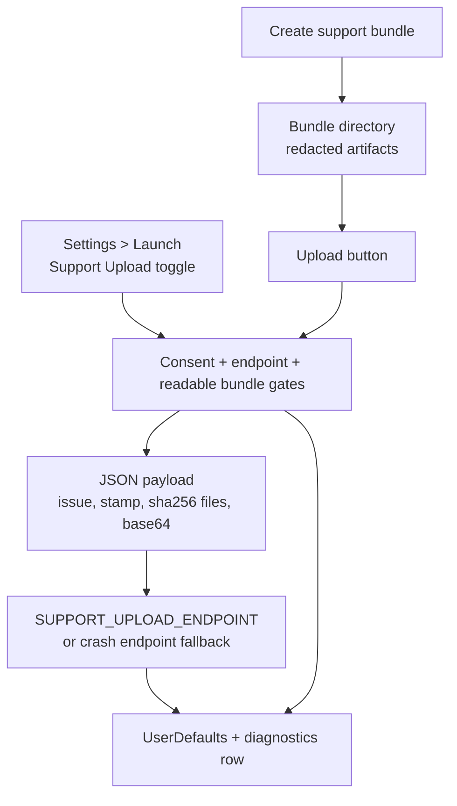
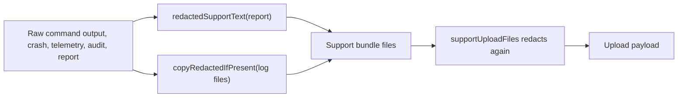
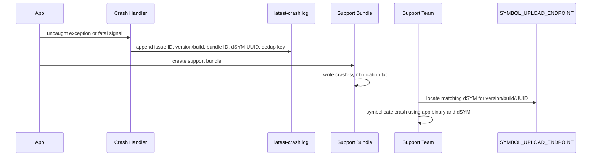
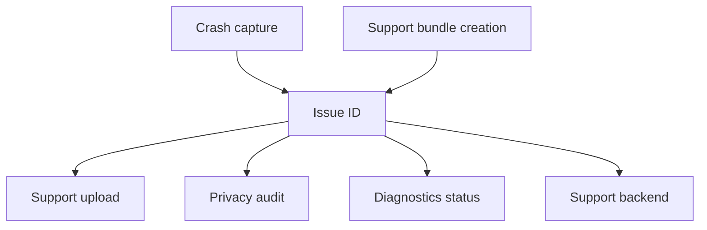
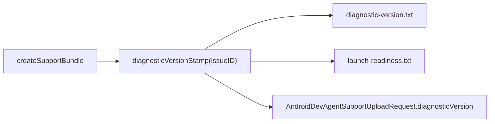
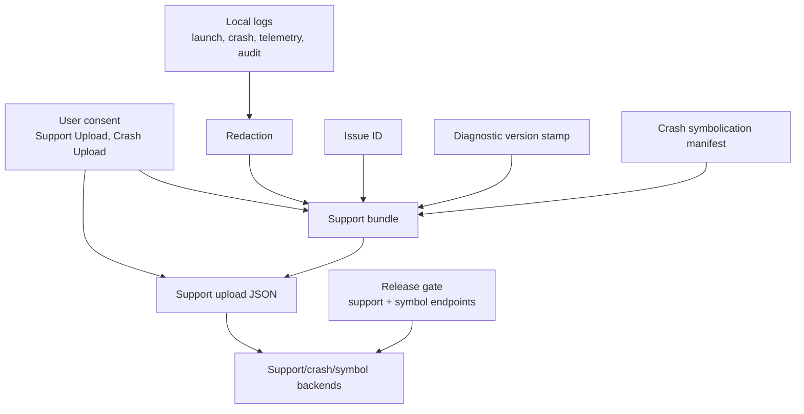

# 07 App Release Readiness Missing Feature Designs

This document focuses on the support infrastructure features added for app release readiness:

- Support bundle upload flow.
- Log redaction.
- Crash symbolication.
- Issue IDs.
- Diagnostic version stamps.

Each design can be validated independently but they are intentionally connected through `AndroidDevAgentLaunchReadiness`.

## 1. Support Bundle Upload Flow

### Goal

Allow support bundles to leave the Mac only when the user has explicitly enabled support upload consent and the signed build has a configured HTTPS upload endpoint.

### Components

| Component | Responsibility |
| --- | --- |
| `supportUploadConsentKey` | Persists user consent in UserDefaults. |
| `latestSupportUploadStatusKey` | Persists latest upload/block/failure status. |
| `AndroidDevAgentSupportBackendTransport` | Abstracts upload transport for production URLSession and smoke-test mock transport. |
| `AndroidDevAgentSupportUploadRequest` | Encodes issue ID, diagnostic stamp, version/build/bundle ID, symbolication text, and redacted files. |
| `AgentViewModel.uploadSupportBundle()` | Gates UI state and reports upload status. |
| `LaunchReadinessDiagnosticsCard` | Provides Upload button next to Support Bundle and Open Bundle. |

### Flow



### Payload Contract

The upload request includes:

- `issueID`
- `diagnosticVersion`
- `appVersion`
- `buildNumber`
- `bundleID`
- `createdAt`
- `symbolication`
- `files[]` with relative path, SHA-256, byte count, redacted flag, truncated flag, and base64 content.

### Size Controls

- Per-file upload cap: `maxSupportUploadFileBytes`.
- Total upload cap: `maxSupportUploadBytes`.
- Files are sorted by relative path for deterministic payload shape.
- Text is redacted again before encoding into the payload.

### Failure Policy

| Failure | Behavior |
| --- | --- |
| No consent | Block upload and privacy-audit `support_bundle_upload_blocked` with `consent_missing`. |
| No endpoint | Block upload and privacy-audit `endpoint_missing`. |
| Missing bundle | Block upload and privacy-audit `bundle_missing`. |
| HTTP non-2xx | Persist sanitized failure message. |
| Non-HTTP response | Persist support backend error. |

## 2. Log Redaction

### Goal

Prevent API keys, bearer tokens, passwords, signing credentials, private keys, and secret-shaped values from appearing in support bundles or support uploads.

### Redaction Layers



### Rules

Line-level markers redact full values after `:` or `=` when lines contain sensitive markers:

- `api_key`, `apikey`
- `authorization`
- `bearer`
- `client_secret`
- `keychain`
- `notarytool`
- `private_key`
- `password`
- `secret`
- `signing_identity`
- `store_password`
- `token`

Regex rules cover:

- OpenAI-style `sk-...` keys.
- GitHub token families.
- Bearer token values.
- Key/value secret assignments.
- PEM private keys.
- Authorization headers.

### Design Decision

Redaction is intentionally duplicated before bundle creation and upload. This avoids trusting intermediate files and lets future bundle content sources inherit the same safety rule without remembering where the content came from.

### Verification

Smoke coverage writes command output containing a bearer token and OpenAI-shaped key, creates a support bundle, then verifies:

- `support-report.txt` exists.
- Redaction marker is present.
- Raw token values are absent.

## 3. Crash Symbolication

### Goal

Give support and release operations enough metadata to symbolicate crash reports by matching a crash/support issue to the shipped app version, build, bundle ID, architecture, and dSYM UUID.

### Components

| Component | Responsibility |
| --- | --- |
| `installCrashReporting()` | Installs uncaught exception and signal handlers. |
| `latest-crash.log` | Local crash report with issue ID, diagnostic schema, version, build, bundle ID, dSYM UUID, deduplication key. |
| `crash-symbolication.txt` | Support bundle manifest with crash endpoint, symbol endpoint, dSYM UUID, architecture, and routing hints. |
| `CRASH_REPORTING_ENDPOINT` | Release endpoint for crash records. |
| `SYMBOL_UPLOAD_ENDPOINT` | Release endpoint for dSYM/symbol metadata. |
| `DSYM_UUID` or `AndroidDevAgentDSYMUUID` | Build stamp used by runtime manifests. |

### Flow



### Release Gate

Market release readiness now requires both:

- `CRASH_REPORTING_ENDPOINT`
- `SYMBOL_UPLOAD_ENDPOINT`

The package script writes `AndroidDevAgentSymbolUploadEndpoint` and optional `AndroidDevAgentDSYMUUID` into Info.plist.

## 4. Issue IDs

### Goal

Make every support bundle and captured crash addressable by a stable support identifier that can be quoted by users, support staff, upload APIs, and crash pipelines.

### Format

```text
ADA-YYYYMMDD-XXXXXXXX
```

The suffix is derived from SHA-256 material that includes the bundle ID, seed material, current timestamp, and a UUID. This is not intended as a secret; it is an operational correlation key.

### Issue ID Touchpoints



### Files and State

- Persisted latest issue ID: `latestSupportIssueIDKey`.
- Support bundle artifact: `issue-id.txt`.
- Upload header: `X-Android-Dev-Agent-Issue`.
- Upload response can echo or override the issue ID.
- Privacy audit records issue ID for created and uploaded bundles.

### Failure Policy

If a support bundle has no readable `issue-id.txt`, upload creates a fresh issue ID from the bundle name. If no issue has ever been assigned, readiness displays `not assigned`.

## 5. Diagnostic Version Stamps

### Goal

Ensure every support bundle and upload carries enough version context to reconstruct runtime conditions without relying only on external release manifests.

### Stamp Fields

`AndroidDevAgentDiagnosticVersionStamp` includes:

- Diagnostic schema version.
- App version.
- Build number.
- Bundle ID.
- macOS version.
- Process name.
- Runtime architecture.
- Issue ID.
- Created timestamp.

### Flow



### Compatibility Rule

The stamp has its own `schemaVersion` so future support tooling can evolve parsing independently from app version. App version/build identifies the shipped binary; diagnostic schema identifies the support artifact format.

### Verification

Smoke coverage asserts that the support bundle includes `diagnostic-version.txt` and that it contains schema and app version fields.

## Combined App Release Readiness View



