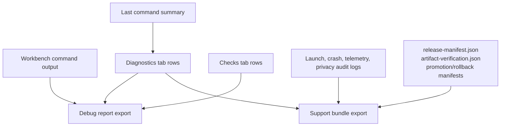

# 08 Test and Observability Architecture

## Purpose

Tests and observability keep the desktop agent releasable as features span SwiftUI, local process execution, Android tooling, privacy gates, support export, and release scripts.

## Test Layers

| Layer | File or command | Coverage |
| --- | --- | --- |
| Core launch executable tests | `Tests/AndroidDevAgentCoreLaunchTests/main.swift` | Planner, scanner, command factory, process runner, and core launch behaviors. |
| Build-tool plugin | `Plugins/RunCoreLaunchTestsPlugin/Plugin.swift` | Runs core launch tests through the Swift test target. |
| Smoke tests | `Sources/AndroidDevAgentSmokeTests/main.swift` | End-to-end app harnesses for planner, tool routing, process execution, UI coverage, editor safety, provider privacy, model setup, launch readiness, and assistant responses. |
| Swift package tests | `swift test` | Runs package-level test integration and plugin checks. |
| Smoke executable | `swift run AndroidDevAgentSmokeTests` | Runs broad non-UI and UI-harness smoke coverage. |
| Script syntax | `bash -n scripts/*.sh` | Catches shell syntax errors. |
| Release gate | `RELEASE=1 bash scripts/release_readiness_check.sh` | Validates required launch evidence and endpoint configuration for market release. |

## Observability Surfaces



## Coverage Harness Design

`AndroidDevAgentUICoverageHarness` exposes focused static methods from the SwiftUI target so the smoke executable can exercise UI-facing state without driving pixels:

- Wireless disconnect diagnostics.
- Device test stop diagnostics.
- Editor save safety diagnostics.
- Assistant privacy diagnostics.
- Assistant model setup diagnostics.
- Launch readiness diagnostics.
- Ask Assistant diagnostics.

This gives the project fast regression coverage for view-model and SwiftUI-adjacent behavior without requiring a GUI automation runner.

## Launch Readiness Verification

The smoke launch-readiness test verifies:

- Rows expose crash reporting, crash symbolication, telemetry, license activation, privacy audit, support redaction, support upload, diagnostic version, onboarding, and release notes.
- Telemetry defaults to off.
- License activation, refresh, offline grace, recovery, and transfer backend contracts work through mocks.
- Support bundles include support report, privacy audit, launch manifest, release notes, issue ID, diagnostic version, redaction summary, and symbolication manifest.
- Support report redacts secret-shaped values.
- Mock support upload accepts the bundle and returns an issue status.

## Release Observability

Release scripts emit machine-readable outputs:

- `release-manifest.json`: bundle metadata, endpoint configuration, artifact paths, hashes, signing/notarization/update flags.
- `artifact-verification.json`: verification evidence for bundle, zip, pkg, appcast, signatures, and notarization.
- `promotion-manifest.json`: hosted appcast promotion inputs and outputs.
- Rollback manifest: restored snapshot and rollback result.

These artifacts should be attached to release candidates and support investigations so runtime support bundle evidence can be compared against shipped artifact evidence.

## Recommended Quality Gates

For documentation-only architecture changes:

```bash
git diff --check
```

For app or support infrastructure changes:

```bash
swift build
swift run AndroidDevAgentSmokeTests
swift test
bash -n scripts/package_macos_app.sh
bash -n scripts/release_readiness_check.sh
```

For release-candidate changes:

```bash
RELEASE=1 bash scripts/release_readiness_check.sh
bash scripts/package_macos_app.sh
bash scripts/verify_release_artifacts.sh
```

Use real release evidence paths and HTTPS endpoints for the final release-candidate gate.

