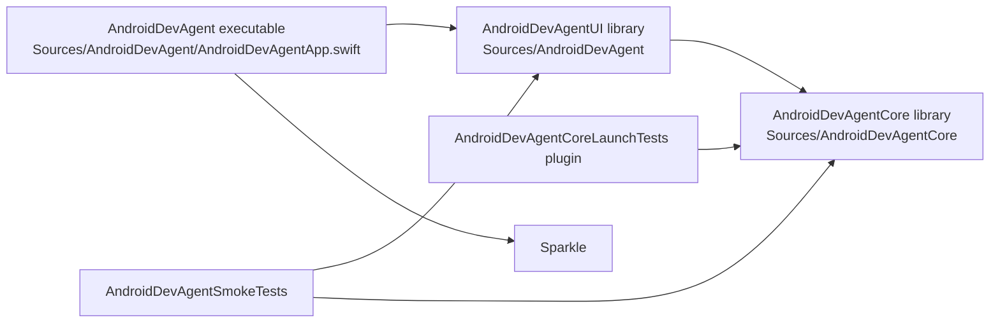

# Android Dev Agent Architecture

This folder captures the Android Dev Agent as a set of focused architecture designs. Each part owns a specific slice of the app so release, support, and future feature work can reason about boundaries without reading the whole codebase.

## Current Target Map

## Design Parts

- [01 Runtime Shell and UI Workbench](01-runtime-shell-and-ui-workbench.md)
  Native macOS shell, SwiftUI workbench, settings, diagnostics, and view model state ownership.
- [02 Project Context and Planning](02-project-context-and-planning.md)
  Android workspace scanning, project profile construction, intent inference, tool routing, and plan generation.
- [03 Command Execution and Device Automation](03-command-execution-and-device-automation.md)
  Gradle, ADB, Logcat, wireless debugging, screenshots, device preview, command lifecycle, and cancellation.
- [04 Assistant Model and Privacy Architecture](04-assistant-model-and-privacy.md)
  Ask Assistant, local response path, TaskDroid/OpenAI routing, credential storage, provider-sharing consent, and redaction.
- [05 Release Packaging and Update Pipeline](05-release-packaging-and-update-pipeline.md)
  Developer ID packaging, notarization, Sparkle updates, release gates, artifact verification, promotion, and rollback.
- [06 Launch Readiness Support Infrastructure](06-launch-readiness-support-infrastructure.md)
  Launch readiness settings, crash reporting, telemetry, privacy audit, licensing, support bundle export, and upload status.
- [07 App Release Readiness Missing Feature Designs](07-app-release-readiness-missing-feature-designs.md)
  Dedicated designs for support bundle upload flow, log redaction, crash symbolication, issue IDs, and diagnostic version stamps.
- [08 Test and Observability Architecture](08-test-and-observability-architecture.md)
  Smoke coverage harnesses, core launch tests, release gates, diagnostics reports, and support observability.

## Cross-Cutting Rules

- The app is local-first. Project files, command output, telemetry, crash logs, and support bundles stay on the Mac unless the user enables a specific consent path.
- `AndroidDevAgentCore` stays UI-neutral and testable. It owns scanning, planning, command descriptions, safety checks, and process execution.
- `AndroidDevAgentUI` owns SwiftUI state, user consent, settings, editor surfaces, diagnostics, and launch-readiness workflows.
- Release infrastructure is configuration-driven. Signed builds receive endpoints and version stamps through Info.plist and release manifests.
- Every support-facing artifact should be redacted, issue-addressable, version-stamped, and reproducible from local logs.

